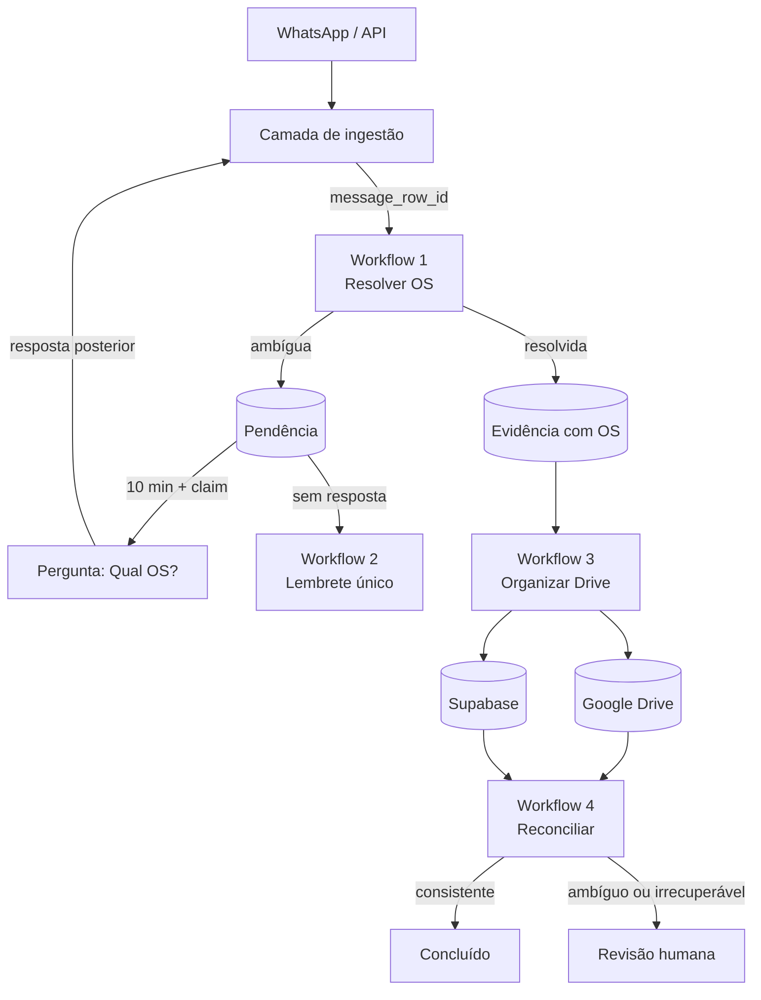
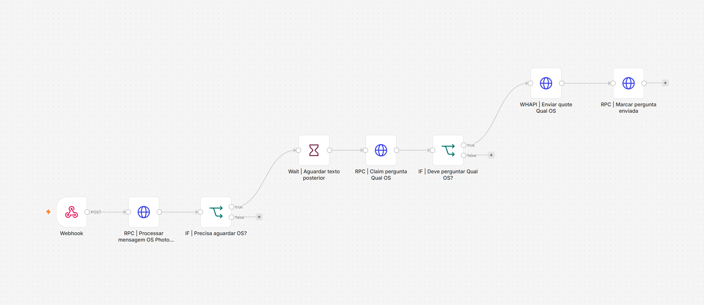
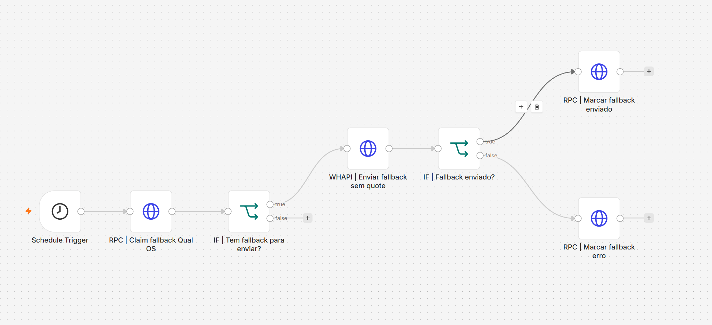
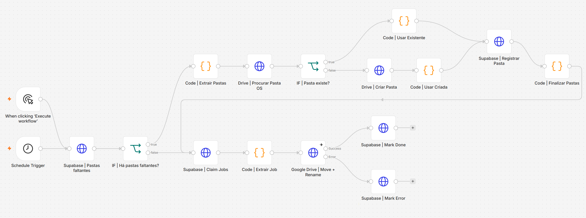
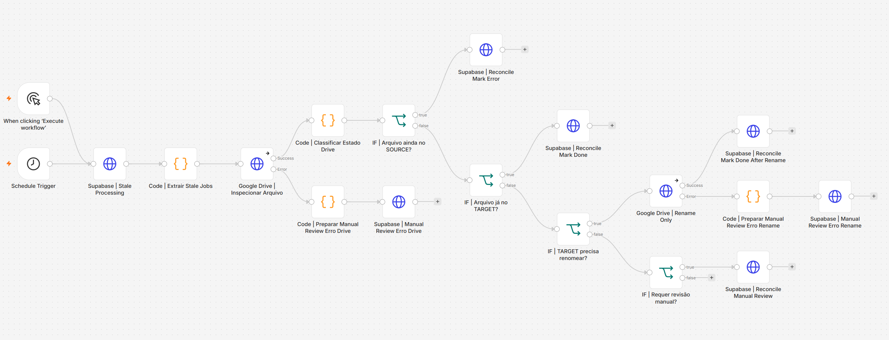

# Automação de evidências fotográficas de Ordens de Serviço

Case técnico de automação operacional que transforma fotos enviadas pelo WhatsApp em evidências vinculadas à OS correta, organizadas no Google Drive e reconciliadas com o estado registrado no banco.

> **Nota de privacidade:** este repositório contém uma representação sanitizada de uma automação real. Credenciais, URLs, IDs, nomes, números, mensagens e referências operacionais foram removidos ou substituídos por dados fictícios.

## Resumo executivo

Em operações de produção, fotos de execução chegam rapidamente e nem sempre acompanhadas do número da Ordem de Serviço. Organizar esse material manualmente gera retrabalho, arquivos fora do lugar e perda de rastreabilidade.

A solução recebe a mensagem já persistida pela camada de ingestão, tenta resolver a OS pelo contexto disponível e só interrompe o usuário quando a informação realmente não pode ser inferida. Depois, organiza o arquivo no Drive e usa um reconciliador independente para confirmar que o estado físico corresponde ao estado lógico do banco.

```text
WhatsApp → ingestão → resolver OS → evidência → organizar Drive → reconciliar
                          │
                          └→ pendência → pergunta → lembrete único
```

## Problema resolvido

- Fotos chegam fora de ordem, em álbuns, com legendas incompletas ou sem OS.
- Perguntas repetidas no grupo criam ruído e atrapalham a operação.
- Uma resposta bem-sucedida de API não garante que o arquivo terminou no local esperado.
- Falhas intermediárias podem deixar banco e Drive em estados divergentes.
- Casos ambíguos não devem ser resolvidos por suposição.

## Solução

A automação separa quatro responsabilidades:

| Workflow | Responsabilidade | Resultado |
| --- | --- | --- |
| `1_OS_PHOTO_EVIDENCE_CAPTURE` | Resolver a OS ou abrir uma pendência | Evidência resolvida ou pergunta controlada |
| `2_OS_PHOTO_EVIDENCE_FALLBACK_REMINDER` | Cobrar uma pendência antiga uma única vez | Lembrete rastreável, sem spam |
| `3_ORGANIZAR_FOTOS_DRIVE` | Criar/localizar pastas e mover arquivos | Foto renomeada na pasta da OS |
| `4_VERIFICAR_CORRIGIR_DRIVE` | Auditar operações incompletas | Banco e Drive reconciliados ou revisão humana |

## Competências demonstradas

Este projeto evidencia experiência prática em:

- análise e automação de processos operacionais reais;
- desenho de workflows desacoplados e orientados por estado;
- integração entre n8n, Supabase, WhatsApp API e Google Drive;
- modelagem de regras de negócio e contratos entre sistemas;
- controle de concorrência e idempotência por claims;
- tratamento de falhas parciais em sistemas distribuídos;
- consistência eventual e reconciliação banco × armazenamento;
- desenho de interações com baixo atrito e prevenção de spam;
- observabilidade, rastreabilidade, retries e revisão humana;
- documentação técnica acessível para diferentes públicos.

## Impacto operacional

A solução reduz organização manual, evita interrupções desnecessárias no grupo de produção e torna auditável o caminho entre a foto recebida e sua pasta final. Em vez de ocultar exceções, registra estados ambíguos e direciona somente esses casos para análise humana.

## Arquitetura



Veja a [arquitetura detalhada](docs/02-arquitetura.md) e o [diagrama macro](assets/diagramas/arquitetura-macro.md).

## Onde está a inteligência

Os workflows n8n atuam como orquestradores. As regras de negócio e transições de estado ficam principalmente em funções RPC no Supabase.

```text
n8n       = coordenação, temporização e integrações externas
Supabase  = regras de negócio, estado, claims e idempotência
WhatsApp  = entrada e interação com a equipe
Drive     = armazenamento físico das evidências
```

Essa divisão mantém o fluxo visual enxuto e centraliza decisões concorrentes em transações controladas pelo banco.

## Diferenciais técnicos

- **Baixo atrito:** pergunta pela OS somente quando contexto, legenda, quote ou mensagens posteriores não resolvem o caso.
- **Claims idempotentes:** uma pendência é reivindicada antes do envio para impedir mensagens duplicadas.
- **Responsabilidades desacopladas:** identificação, cobrança, movimentação e reconciliação evoluem separadamente.
- **Consistência eventual:** um watchdog compara o resultado esperado com o estado real do Drive.
- **Recuperação orientada por estado:** arquivos no destino com nome incorreto são apenas renomeados; arquivos ainda na origem voltam para retry.
- **Human-in-the-loop:** ambiguidades e estados inesperados são preservados para análise humana.
- **Rastreabilidade:** sucessos, erros, respostas externas e motivos de revisão são persistidos.

## Stack

- **n8n** — orquestração dos quatro workflows
- **Supabase / PostgreSQL RPCs** — estado, regras de negócio e controle de concorrência
- **WhatsApp API** — mensagens, quotes e menções
- **Google Drive API** — busca, criação de pastas, movimentação e renomeação
- **JavaScript** — normalização e classificação de estados no n8n
- **JSON / REST** — contratos entre componentes

## Fluxos principais

### Foto com OS identificável

```text
foto + contexto → OS resolvida → evidência → pasta da OS → move + rename → done
```

### Foto sem OS

```text
foto → pending → espera 10 min → claim → “Qual OS?” → resposta → evidência
```

### Ausência de resposta

```text
pergunta enviada → 20 min → claim do fallback → uma menção → fim das cobranças
```

### Estado divergente no Drive

```text
job processing há 2 min → inspeção física → done | rename | retry | revisão humana
```

## Estrutura do repositório

```text
.
├── README.md
├── .gitignore
├── assets/
│   ├── diagramas/
│   └── screenshots/
├── docs/
│   ├── README.md
│   ├── 01-visao-geral.md
│   ├── 02-arquitetura.md
│   ├── 03-estados-e-idempotencia.md
│   ├── 04-workflow-1-captura.md
│   ├── 05-workflow-2-fallback.md
│   ├── 06-workflow-3-organizacao-drive.md
│   ├── 07-workflow-4-reconciliacao.md
│   ├── 08-privacidade-e-sanitizacao.md
│   └── 09-escopo-do-case.md
├── samples/
└── workflows/sanitizados/
```

## Como navegar

- Comece pela [visão geral](docs/01-visao-geral.md).
- Entenda os limites dos componentes na [arquitetura](docs/02-arquitetura.md).
- Veja concorrência e transições em [estados e idempotência](docs/03-estados-e-idempotencia.md).
- Consulte o detalhamento de cada workflow no [índice técnico](docs/README.md).
- Explore contratos fictícios em [`samples/`](samples/README.md).
- Inspecione os [exports sanitizados](workflows/sanitizados/README.md).

## Capturas de tela

As quatro capturas mostram a topologia completa dos workflows, com nomes dos nós e ramificações legíveis. URLs e referências sensíveis exibidas sob os nós foram ocultadas.

### Workflow 1 — Captura e resolução da OS



### Workflow 2 — Fallback controlado



### Workflow 3 — Organização no Google Drive



### Workflow 4 — Reconciliação do Google Drive



Os parâmetros relevantes que não aparecem no canvas estão descritos na [documentação técnica](docs/README.md). Não são necessárias capturas internas dos nós.

## Escopo público

Este case documenta a arquitetura e os workflows de orquestração. O código interno das RPCs, a ingestão produtiva, credenciais, dados reais e detalhes de infraestrutura não fazem parte da publicação.

Os exports sanitizados são evidências técnicas para inspeção da lógica e das conexões. Não representam um pacote instalável nem um backup do ambiente produtivo.

## Status

Case técnico preparado para portfólio público, com documentação, exemplos fictícios e workflows sanitizados.
