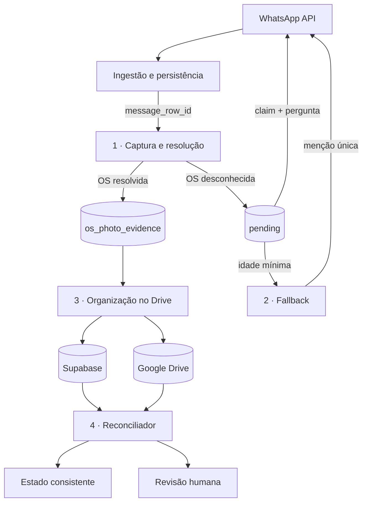

# Arquitetura macro

```mermaid
flowchart TB
    WH[WhatsApp API] --> ING[Ingestão e persistência]
    ING -->|message_row_id| W1[1 · Captura e resolução]
    W1 -->|OS resolvida| E[(os_photo_evidence)]
    W1 -->|OS desconhecida| P[(pending)]
    P -->|claim + pergunta| WH
    P -->|idade mínima| W2[2 · Fallback]
    W2 -->|menção única| WH
    E --> W3[3 · Organização no Drive]
    W3 --> DB[(Supabase)]
    W3 --> GD[(Google Drive)]
    DB --> W4[4 · Reconciliador]
    GD --> W4
    W4 --> OK[Estado consistente]
    W4 --> MR[Revisão humana]
```

