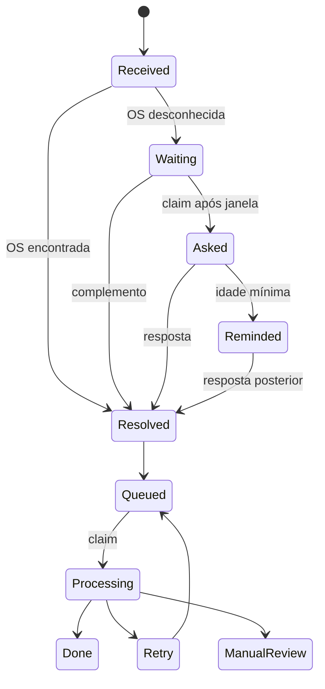

# Máquina de estados

```mermaid
stateDiagram-v2
    [*] --> Received
    Received --> Resolved: OS encontrada
    Received --> Waiting: OS desconhecida
    Waiting --> Resolved: complemento
    Waiting --> Asked: claim após janela
    Asked --> Resolved: resposta
    Asked --> Reminded: idade mínima
    Reminded --> Resolved: resposta posterior
    Resolved --> Queued
    Queued --> Processing: claim
    Processing --> Done
    Processing --> Retry
    Processing --> ManualReview
    Retry --> Queued
```

