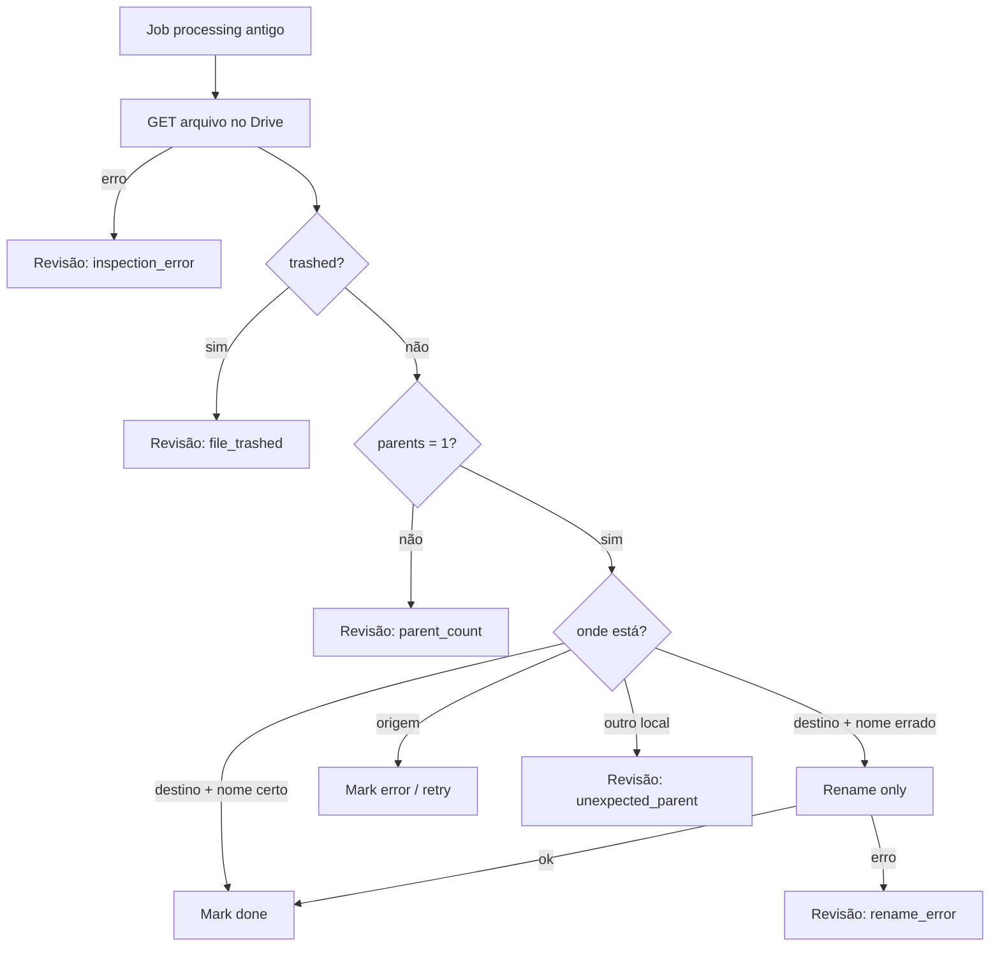

# Reconciliação banco × Drive

```mermaid
flowchart TD
    A[Job processing antigo] --> B[GET arquivo no Drive]
    B -->|erro| MR1[Revisão: inspection_error]
    B --> C{trashed?}
    C -->|sim| MR2[Revisão: file_trashed]
    C -->|não| D{parents = 1?}
    D -->|não| MR3[Revisão: parent_count]
    D -->|sim| E{onde está?}
    E -->|destino + nome certo| DONE[Mark done]
    E -->|destino + nome errado| REN[Rename only]
    REN -->|ok| DONE
    REN -->|erro| MR4[Revisão: rename_error]
    E -->|origem| RETRY[Mark error / retry]
    E -->|outro local| MR5[Revisão: unexpected_parent]
```

