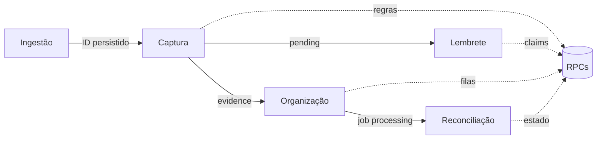

# Arquitetura

## Componentes

| Componente | Responsabilidade |
| --- | --- |
| Camada de ingestão | Receber eventos, persistir mensagem e mídia e produzir `message_row_id` |
| n8n | Orquestrar tempo, RPCs e APIs externas |
| Supabase | Manter estado, executar regras e controlar claims |
| WhatsApp API | Entregar perguntas, quotes, menções e respostas |
| Google Drive | Manter os arquivos físicos e a hierarquia de pastas |

## Contrato de entrada

O webhook do Workflow 1 não recebe o evento cru da API de WhatsApp. Ele espera que uma camada anterior já tenha persistido a mensagem:

```json
{
  "message_row_id": "00000000-0000-4000-8000-000000000001"
}
```

Essa decisão desacopla particularidades do provedor de mensageria das regras de evidência.

## Separação de responsabilidades



Cada workflow conhece apenas o contrato necessário para sua função. O organizador não interpreta mensagens; o reconciliador não inventa uma OS; o lembrete não tenta resolver contexto.

## Verdade lógica e verdade física

O sistema distingue duas fontes de verdade:

- **Verdade lógica:** a foto pertence a determinada OS e o job possui um estado no banco.
- **Verdade física:** o arquivo possui nome, parent e status reais no Drive.

O Workflow 4 existe porque uma chamada externa pode concluir depois de um timeout, falhar parcialmente ou retornar antes da persistência do estado. A reconciliação observa o recurso externo, em vez de confiar apenas no histórico da chamada.

## Consistência eventual

```text
claim do job → operação externa → confirmação no banco
                     │
                     └→ falha/interrupção → inspeção posterior → reconciliação
```

Esse modelo evita transações distribuídas frágeis e permite recuperação orientada pelo estado observado.

## Limites do case público

As funções RPC são descritas por seus contratos e responsabilidades, mas sua implementação produtiva não é publicada. Também ficam fora do escopo a ingestão, o cockpit de revisão e detalhes de infraestrutura.

