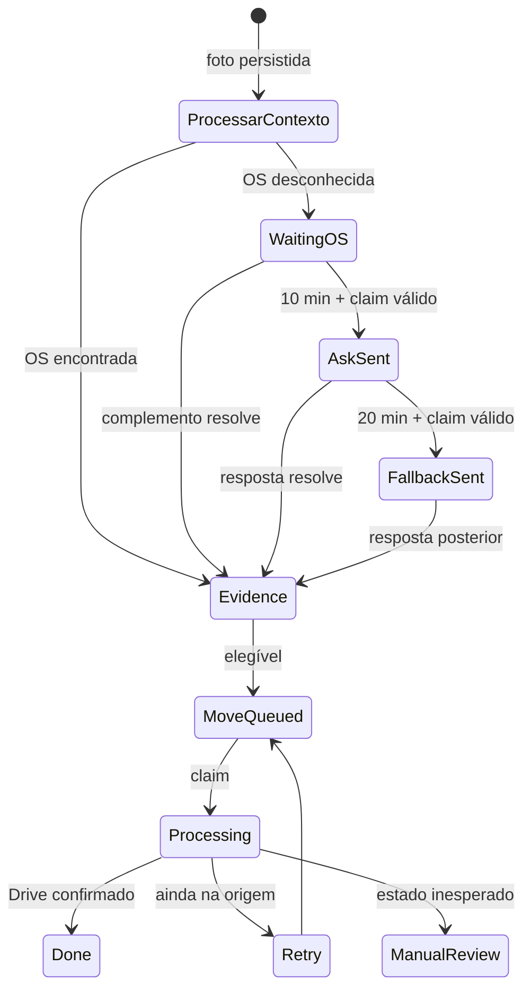

# Estados, concorrência e idempotência

## Máquina de estados simplificada



## Claims

Antes de enviar uma pergunta, fallback ou executar um movimento, o workflow solicita ao banco o direito de agir sobre aquele item. A RPC revalida o estado dentro da transação.

Isso protege contra:

- duas execuções do Schedule selecionarem a mesma pendência;
- uma OS ser resolvida durante a janela de espera;
- repetição causada por retry do n8n;
- perguntas duplicadas para fotos do mesmo lote;
- jobs de Drive processados em paralelo sem coordenação.

## Idempotência de mensageria

O fluxo de pergunta é:

```text
pending → espera → claim_ask → ask_required → enviar → mark_ask_sent
```

O fallback repete o padrão com idade mínima e limite de tentativas. A decisão final continua no banco, não no Schedule Trigger.

## Idempotência de arquivos

O movimento é registrado como job. Se a confirmação não for persistida, o reconciliador inspeciona o arquivo:

| Estado observado | Ação |
| --- | --- |
| Destino e nome corretos | Marcar concluído |
| Destino e nome incorreto | Renomear e concluir |
| Origem | Marcar erro para retry |
| Lixeira, múltiplos parents ou outro local | Revisão humana |
| Falha ao inspecionar ou renomear | Revisão humana |

## Princípio de segurança

Quando não há informação suficiente, o sistema não fabrica uma decisão. Ele mantém a pendência ou registra revisão manual com snapshot e motivo estruturado.

