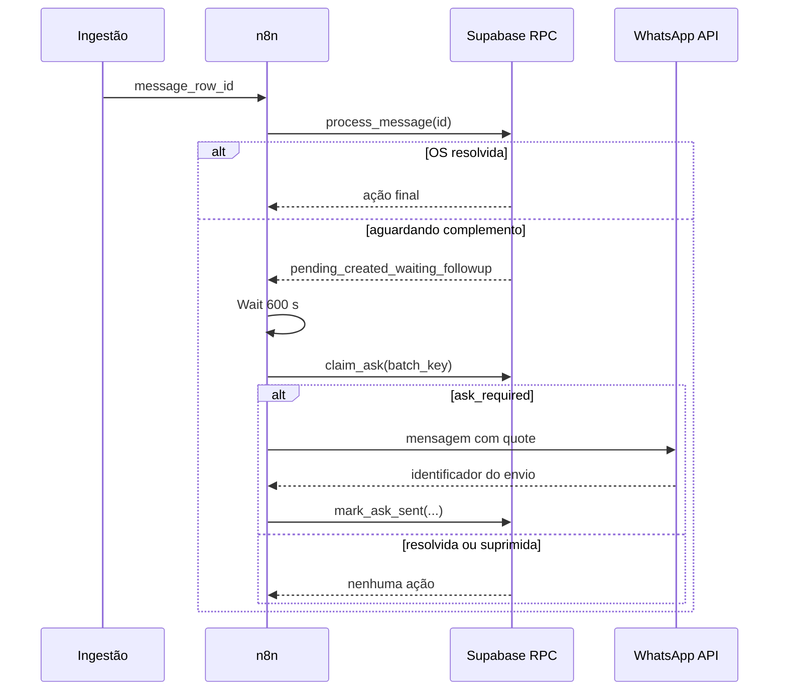

# Workflow 1 — captura e resolução da OS

## Responsabilidade

Receber o identificador de uma mensagem persistida, solicitar ao banco o processamento contextual e controlar a primeira pergunta quando a OS não puder ser resolvida.


## Gatilho

```text
POST /os-photo-evidence-capture
```

Payload demonstrativo:

```json
{
  "message_row_id": "00000000-0000-4000-8000-000000000001"
}
```

## Sequência



## Nós principais

1. **Webhook** — recebe o contrato interno.
2. **Processar mensagem** — chama a RPC com `message_row_id`.
3. **Precisa aguardar OS?** — continua apenas para `pending_created_waiting_followup`.
4. **Wait** — abre janela de 10 minutos para edição, legenda, álbum ou texto posterior.
5. **Claim pergunta** — revalida a pendência e evita concorrência.
6. **Deve perguntar?** — exige `ask_required`.
7. **Enviar quote** — responde à mídia escolhida pelo claim.
8. **Marcar pergunta enviada** — persiste identificador e resposta externa.

## Decisão arquitetural

O Wait não representa uma decisão. Após a espera, a RPC verifica novamente o estado. Assim, uma resposta recebida durante a janela cancela naturalmente a pergunta.

Os parâmetros essenciais são a espera de `600` segundos e o claim com `batch_key` antes do envio. Eles estão descritos na sequência acima; uma captura interna dos nós não acrescentaria contexto relevante ao case.

## O que este workflow não faz

- Não recebe payload cru do provedor de WhatsApp.
- Não move arquivos no Drive.
- Não implementa todas as regras contextuais visualmente.
- Não envia fallback.
