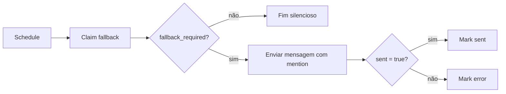

# Workflow 2 — fallback controlado

## Responsabilidade

Enviar uma única lembrança quando a pergunta inicial já foi realizada e a pendência continua sem resolução.


## Gatilho e elegibilidade

O Schedule Trigger roda periodicamente. A RPC aplica os critérios reais:

```text
pergunta enviada
+ idade mínima de 20 minutos
+ pendência ainda aberta
+ não suprimida
+ menos de 1 tentativa
= fallback elegível
```

No contrato analisado, a idade mínima é `20` minutos e o limite é `1` tentativa. Esses valores são suficientes para compreender a proteção contra cobranças repetidas, sem necessidade de expor o painel interno do nó.

## Sequência



## Características

- Mensagem sem quote, com menção ao responsável original.
- Claim transacional antes do envio.
- Limite máximo de uma tentativa no contrato analisado.
- Persistência separada para sucesso e falha.
- Nenhuma tentativa de reinterpretar ou descobrir a OS.

## Relação com o Workflow 1

O Workflow 1 cria e pergunta; o Workflow 2 apenas observa perguntas antigas ainda não resolvidas. Se uma resposta posterior resolver a pendência, ela deixa de ser elegível ao fallback.
