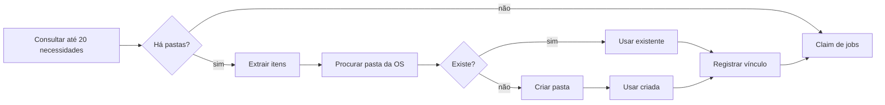

# Workflow 3 — organização no Google Drive

## Responsabilidade

Materializar no Drive uma decisão já tomada pelo banco: localizar ou criar a pasta da OS, mover a foto e aplicar o nome final.


## Frequência

- Schedule a cada 1 minuto.
- Trigger manual disponível para operação assistida.

## Etapa 1 — pastas



O vínculo persistido representa:

```text
pasta do dia + número da OS → pasta física no Drive
```

## Etapa 2 — arquivos

O claim retorna até 10 jobs com os identificadores de origem, destino, arquivo e nome final. A chamada `PATCH` do Drive realiza em uma operação:

```text
addParents    = target_folder_id
removeParents = source_folder_id
name          = target_filename
```

Esses três parâmetros documentam integralmente a operação relevante. A URL real, a credencial e o painel interno do nó não fazem parte do case público.

## Saídas

- **Sucesso:** marca o job como concluído.
- **Erro:** persiste a resposta de falha e libera o fluxo de recuperação previsto no banco.

O nó de movimento possui saída específica de erro, evitando que uma falha externa seja tratada como sucesso.

## O que este workflow não faz

- Não lê legenda nem contexto do WhatsApp.
- Não infere número de OS.
- Não confirma sozinho estados antigos ou ambíguos; essa função pertence ao reconciliador.
