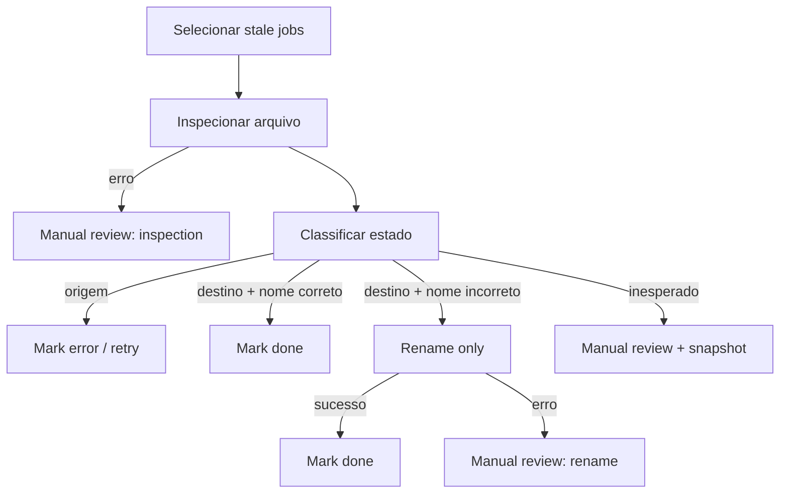

# Workflow 4 — reconciliação do Drive

## Responsabilidade

Auditar jobs que permaneceram em processamento e reconciliar o banco com o estado físico observado no Google Drive.


## Frequência e seleção

- Schedule a cada 2 minutos.
- Execução manual disponível.
- Seleção de até 20 jobs com idade mínima de 120 segundos.

## Dados inspecionados

Para cada arquivo, a API retorna somente os campos necessários:

```text
id, name, parents, trashed
```

## Matriz de decisão

| Observação física | Ação | Motivo estruturado |
| --- | --- | --- |
| `trashed = true` | Revisão humana | `file_trashed` |
| Quantidade de parents diferente de 1 | Revisão humana | `unexpected_parent_count` |
| No destino e nome correto | Marcar concluído | `file_already_in_target_with_correct_name` |
| No destino e nome incorreto | Renomear e concluir | `file_already_in_target_with_wrong_name` |
| Ainda na origem | Marcar erro/retry | `file_still_in_source` |
| Em outro parent | Revisão humana | `unexpected_parent` |
| Falha de inspeção | Revisão humana | `drive_inspection_error` |
| Falha de rename | Revisão humana | `drive_rename_error` |

A matriz registra o comportamento implementado pelo nó de classificação. Ela comunica as decisões com mais clareza do que uma captura parcial do código interno.

## Fluxo



## Por que não repetir o movimento sempre

Reexecutar cegamente uma operação externa pode introduzir novas inconsistências. O reconciliador escolhe a ação mínima com base no estado observado: apenas confirma, apenas renomeia, agenda retry ou interrompe para análise humana.

Esse comportamento demonstra uma estratégia de recuperação compatível com sistemas distribuídos e APIs sujeitas a falhas parciais.
